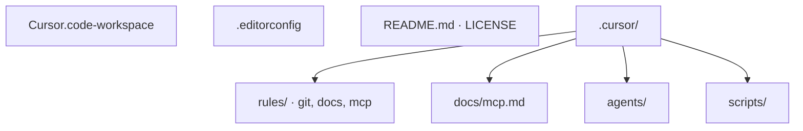
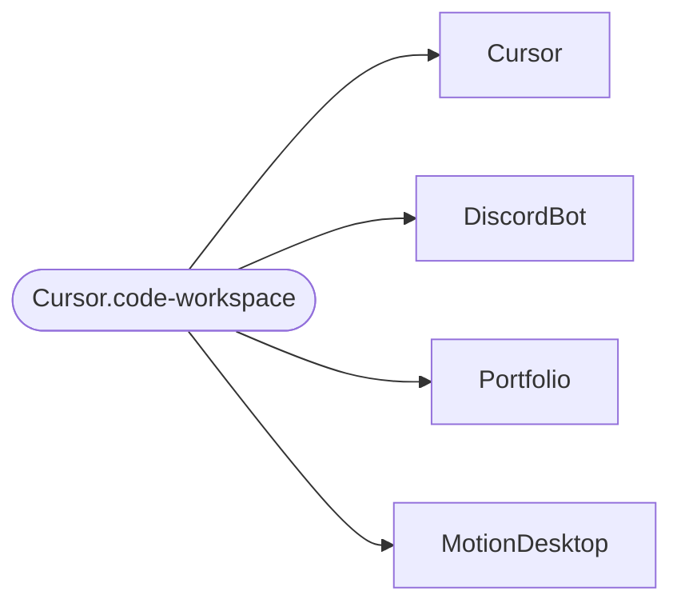

# Cursor


This repository manages shared Cursor IDE rules, documentation, and workspace settings.

## Overview

It centralizes Cursor rules, MCP documentation, and helper scripts so multiple projects can follow a consistent AI agent workflow.

## Structure

```text
.
├── .editorconfig              # Shared indentation / newline defaults (Editor Config)
├── Cursor.code-workspace      # Multi-root workspace; open this in Cursor
├── LICENSE
├── README.md
└── .cursor/
    ├── README.md              # Index for the .cursor directory
    ├── agents/
    │   └── README.md          # Agent definition placement and conventions
    ├── docs/
    │   └── mcp.md             # MCP server usage guide
    ├── rules/
    │   ├── docs/
    │   │   └── readme-rules.mdc
    │   ├── git/
    │   │   └── git-rules.mdc  # Git workflow and commit conventions
    │   └── mcp/
    │       ├── context7-rules.mdc
    │       ├── drawio-rules.mdc
    │       └── markitdown-rules.mdc
    └── scripts/
        ├── README.md          # Script index
        ├── drawio-mcp.sh      # draw.io MCP startup wrapper
        └── markitdown-mcp.sh # MarkItDown MCP (venv or PATH)
```

Summary (same layout as a diagram):



## Workspace

`Cursor.code-workspace` groups the following projects into a multi-root workspace. Keep this table aligned with the `folders` list in that file.

| Folder | Path | Description |
|--------|------|-------------|
| Cursor | `.` | This repository for shared rules and settings |
| DiscordBot | `../DiscordBot` | Discord bot in TypeScript |
| Portfolio | `../Portfolio` | Personal portfolio site |
| MotionDesktop | `../MotionDesktop` | Motion planning desktop app docs and files |

Multi-root layout (folders appear together in the Explorer when you open the workspace file):



## Workspace tips

- **Build task**: Press **Cmd+Shift+B** (macOS) or **Ctrl+Shift+B** (Windows/Linux) to run **Git: fetch all workspaces** (default build task).
- **Git status across repos**: **Terminal → Run Task… → Git: status all workspaces** prints `git status -sb` for each folder in order.
- **Window and tabs**: Workspace settings use `${rootName}` in the window title and **medium** editor labels so it is easier to see which root folder you are in when filenames repeat across repos.

## Workspace navigation (“code map” style tools)

VS Code / Cursor does **not** ship a Visual Studio–style **Code Map** diagram (dependency graph) in the core product. For orientation and structure, use the built-ins below or extensions.

| Goal | Built-in |
|------|----------|
| **Tree of symbols** in the open file (classes, functions, headings) | **Outline** view (`View → Appearance → Outline`, or move it next to Explorer) |
| **Where you are** in path / symbol hierarchy | **Breadcrumbs** (below the editor tab); click segments to navigate |
| **Bird’s-eye** scroll strip for long files | **Minimap** (`View → Appearance → Minimap`; optional per taste) |
| **Jump across all roots** by symbol name | **Go to Symbol in Workspace…** — default shortcut is often **Cmd+T** (macOS) / **Ctrl+T** (Windows/Linux) |
| **Find text** across every folder | **Search** (`Cmd/Ctrl+Shift+F`). Scope is the whole workspace; use “files to include” or restrict to a folder when needed |
| **Per-repository Git** | **Source Control** — each root is its own repo; pin/hide repos from the “Source Control Repositories” view if the list is noisy |
| **Whole-codebase questions (Cursor)** | Chat / Composer with **`@Codebase`** or attach folders/files so answers respect this workspace |

Conceptual map (same ideas as the table):

```mermaid
flowchart TB
  subgraph file["Current file"]
    OL[Outline — symbol tree]
    BR[Breadcrumbs]
    MM[Minimap optional]
  end
  subgraph ws["Workspace"]
    SYM[Go to Symbol in Workspace]
    SRC[Search]
    GIT[Source Control — per repo]
    CB[@Codebase / Chat]
  end
```

Multi-root tip: In the **Explorer**, each workspace folder is a separate root—collapse ones you are not touching to reduce noise.

For language-specific **import or dependency graphs**, use an extension from the Marketplace (examples: npm/TypeScript dependency viewers, Swift module graphs).

## Setup

1. Clone this repository as `Cursor`.
2. Place related repositories under the same parent directory as `Cursor`.
3. Open `Cursor.code-workspace` in Cursor.

Recommended directory layout:

```text
Git/
├── Cursor
├── DiscordBot
├── Portfolio
└── MotionDesktop
```

## Documentation

- Main index: `.cursor/README.md`
- MCP setup guide: `.cursor/docs/mcp.md`
- Rules index: `.cursor/rules/README.md`
- Script index: `.cursor/scripts/README.md`
- Agent conventions: `.cursor/agents/README.md`

## Rules

| Rule | Applies when | Purpose |
|------|--------------|---------|
| `git-rules.mdc` | Always | Conventional Commits, main-only workflow, SemVer, and release tags starting from `v1.0.0` |
| `readme-rules.mdc` | When editing `**/README.md` | README structure, badges, writing style, and Markdown diagram guidance |
| `context7-rules.mdc` | Always | Use Context7 MCP when fetching library documentation |
| `drawio-rules.mdc` | As needed | Guidance for creating and editing diagrams with draw.io MCP |
| `markitdown-rules.mdc` | As needed | Guidance for converting documents to Markdown with MarkItDown MCP |

For more detail on Git workflow rules, start from `.cursor/rules/README.md`.

## License

[MIT](LICENSE)
